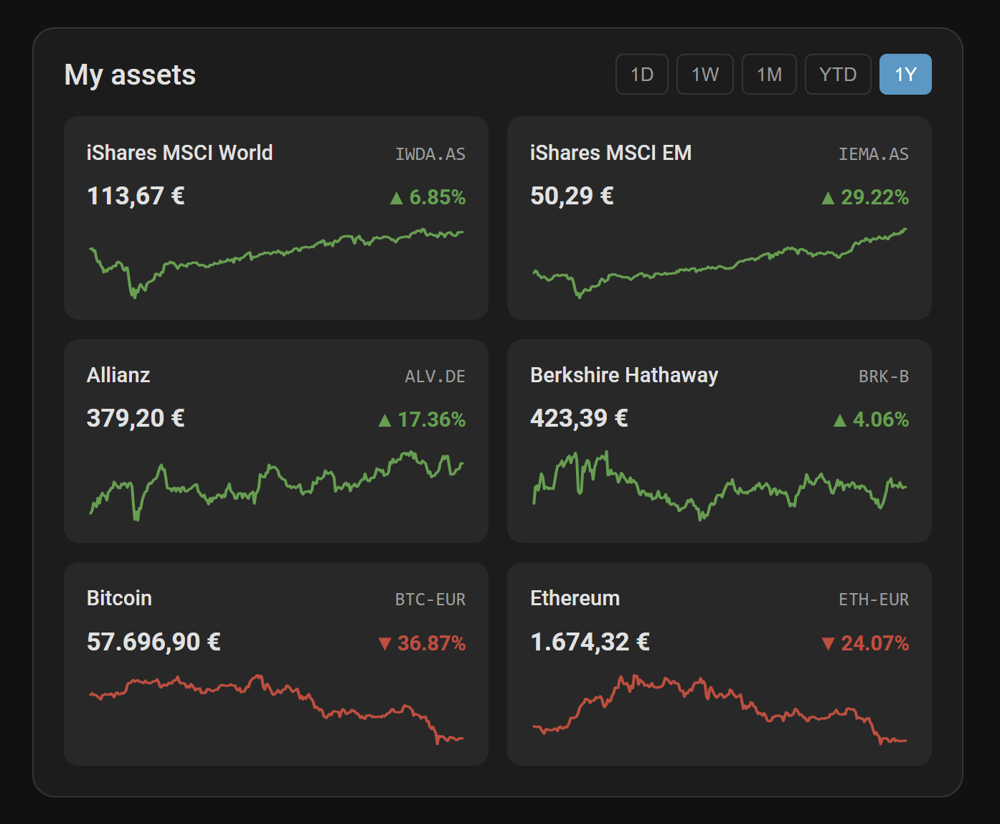
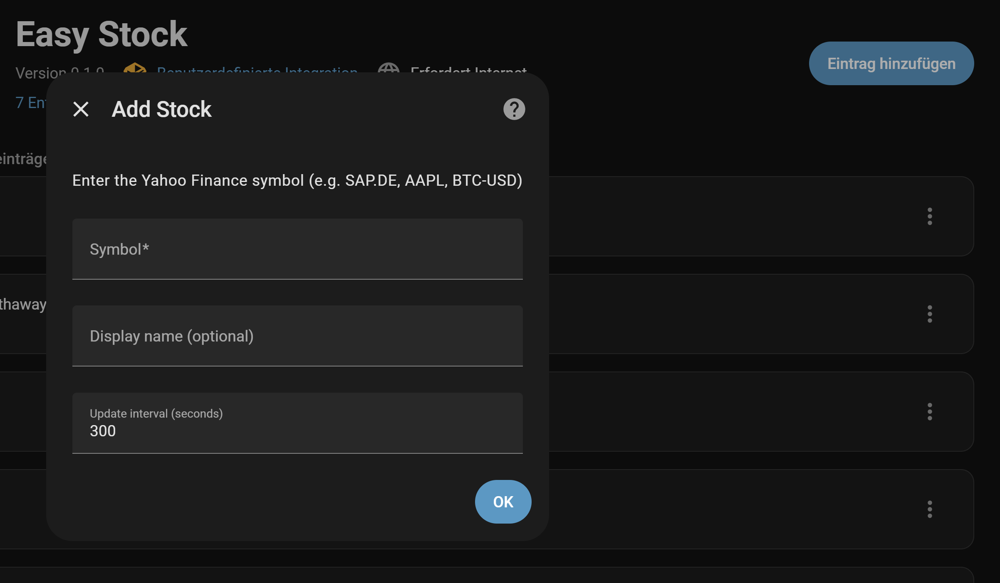
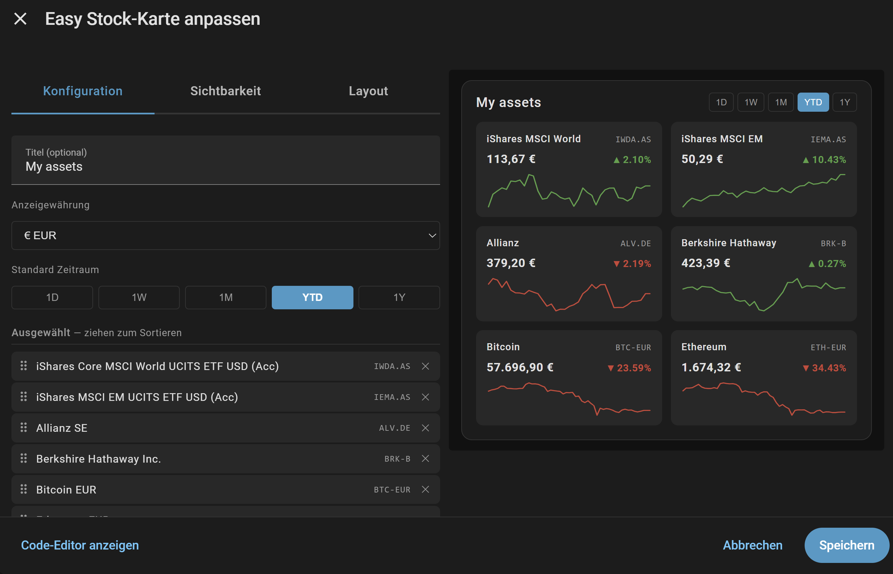

# Easy Stock — Home Assistant Integration

> If you run into a problem, please [open an issue](https://github.com/derspe/ha-easy-stock/issues) so it can be tracked and fixed.

Track stocks, ETFs, and cryptocurrencies directly in Home Assistant — powered by Yahoo Finance, with a built-in Lovelace card featuring sparkline charts.

**No API key required. Fully configured through the UI — no YAML needed.**



## Features

- **Any asset on Yahoo Finance** — stocks, ETFs, index funds, cryptocurrencies, commodities
- **Sensor entity per asset** — current price, daily change, market state and more as attributes
- **History recording** — works with the HA recorder out of the box (`SensorStateClass.MEASUREMENT`)
- **Built-in Lovelace card** — auto-registered, no manual resource setup required
  - Sparkline charts for 5 time ranges: **1D · 1W · 1M · YTD · 1Y**
  - Short-term (1D/1W) charts use HA recorder data (resolution matches the configured poll interval)
  - Long-term charts (1M/YTD/1Y) use daily closing prices from Yahoo Finance
  - **Currency conversion** — display all assets in a single currency (EUR, USD, GBP, CHF, AUD, CAD, JPY, SEK, NOK, DKK, CNY, HKD); rates refreshed every 15 minutes from [frankfurter.app](https://frankfurter.app), with automatic fallback to the last known rates if the source is temporarily unavailable
  - **Reference price** — period baseline shown below the current price (e.g. previous close for 1D, period start for 1W/1M/YTD/1Y)
  - **Click any tile** to open the HA sensor detail dialog
  - **Tile size** — choose S / M / L in the visual editor to control how many tiles fit per row
  - **Visual card editor** with drag & drop to reorder assets
  - **20 languages** — UI adapts automatically to your HA language (en, de, fr, nl, es, it, pt, pl, sv, da, nb, fi, cs, hu, ru, zh, ja, ko, tr, ar)
- **Configurable polling interval** — 60 s to 24 h (default: 15 min)
- **No API key required**

## Requirements

- Home Assistant 2023.x or newer
- Internet access (Yahoo Finance API + frankfurter.app for currency rates)

## Installation

### Via HACS (recommended)

1. Open **HACS** in your Home Assistant sidebar
2. Search for **Easy Stock**
3. Click **Download**
4. Restart Home Assistant

### Manual

1. Download or clone this repository
2. Copy the `custom_components/easy_stock/` folder into your HA config directory:
   ```
   config/
   └── custom_components/
       └── easy_stock/
   ```
3. Restart Home Assistant

## Setup

### Add an asset

1. Go to **Settings → Devices & Services → Add Integration**
2. Search for **Easy Stock**
3. Fill in the form:

| Field | Description |
|---|---|
| **Symbol** | Yahoo Finance ticker (see examples below) |
| **Name** | Display name shown in the card (optional — falls back to the symbol if left empty) |
| **Update interval** | How often to poll Yahoo Finance in seconds (60–86400, default 900) |

Repeat for each asset you want to track. Each asset becomes its own sensor entity.



### Finding the right symbol

Use the search on [finance.yahoo.com](https://finance.yahoo.com) to find the exact ticker for your asset:

| Asset | Symbol |
|---|---|
| Apple | `AAPL` |
| iShares MSCI World (Amsterdam) | `IWDA.AS` |
| iShares MSCI World (Frankfurt) | `EUNL.DE` |
| Berkshire Hathaway B | `BRK-B` |
| Bitcoin / EUR | `BTC-EUR` |
| Ethereum / USD | `ETH-USD` |
| Gold (1 oz) ETC | `4GLD.DE` |
| S&P 500 ETF | `SPY` |

> **Tip:** For European ETFs the exchange suffix matters — `.DE` (Frankfurt), `.AS` (Amsterdam), `.MI` (Milan), `.VI` (Vienna), etc.

## Sensor Attributes

The sensor **state** is the current price (numeric), and the **unit of measurement** is the asset's native trading currency (e.g. `EUR`, `USD`).

Each sensor additionally exposes the following state attributes:

| Attribute | Type | Description |
|---|---|---|
| `symbol` | string | Yahoo Finance ticker |
| `long_name` | string | Full asset name from Yahoo Finance |
| `currency` | string | Native trading currency (e.g. `EUR`, `USD`) |
| `market_state` | string | `REGULAR`, `CLOSED`, `PRE`, `POST` |
| `change` | float | Absolute price change from previous close |
| `change_pct` | float | Percentage change from previous close |
| `previous_close` | float | Previous closing price |
| `price_is_live` | bool | `true` when market is open or asset trades 24/7 |

## Lovelace Card

The card is automatically registered when the integration loads — no manual resource configuration needed.



### Add to dashboard

1. Edit your dashboard → **Add Card** → search for **Easy Stock Card**
2. Select the assets to display and configure the card using the visual editor

### Card configuration (YAML)

```yaml
type: custom:easy-stock-card
title: My Portfolio          # optional
display_currency: EUR        # optional — EUR (default), USD, GBP, CHF, AUD, CAD, JPY, SEK, NOK, DKK, CNY, HKD
default_range: "1T"          # optional — 1T (1D), 1W, 1M, YTD, 1J (1Y) — default: 1T
tile_size: small             # optional — small (default), medium, large
entities:
  - sensor.aapl
  - sensor.iwda_as
  - sensor.btc_eur
```

### Time ranges

| Value | Meaning | Data source |
|---|---|---|
| `1T` | 1 Day | HA recorder (resolution = poll interval) |
| `1W` | 1 Week | HA recorder (resolution = poll interval) |
| `1M` | 1 Month | Yahoo Finance daily closes |
| `YTD` | Year to date | Yahoo Finance daily closes |
| `1J` | 1 Year | Yahoo Finance daily closes |

> **Note:** 1D and 1W charts use HA recorder data. Resolution depends on the configured poll interval (default: 15 min). Until enough history has accumulated, the card falls back automatically: the 1D chart shows a two-point line from the previous close to the current price; the 1W chart uses the last 4 daily closes from Yahoo Finance. Full resolution for the 1W view builds up over 7 days. Charts for 1M, YTD, and 1Y are sourced entirely from Yahoo Finance and are available from the first update.

## Troubleshooting

**No data / sensor unavailable**
- Verify the ticker symbol is correct on [finance.yahoo.com](https://finance.yahoo.com)
- Some symbols require the exchange suffix (e.g. `IWDA.AS` not just `IWDA`)
- Check Home Assistant logs for detailed error messages

**1D/1W chart is flat or empty**
- The HA recorder may not have built up enough history yet — check back after a few polling cycles
- Ensure the `recorder` integration is enabled in your `configuration.yaml`

**Currency conversion not working**
- The card fetches rates from [frankfurter.app](https://frankfurter.app) (European Central Bank data) — ensure your HA instance has internet access

**Wrong display name**
- Set a custom **Name** in the integration configuration (Settings → Devices & Services → Easy Stock → Configure)

**Infos in German language**
- See https://smart-home-insights.net/home-assistant/aktien-etfs-und-krypto-in-home-assistant

## License

MIT
